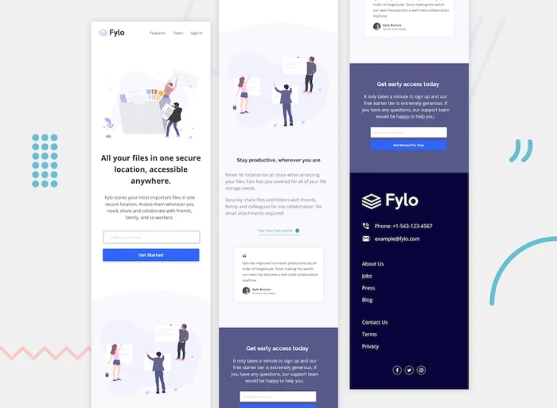

# Landing Page con React, Svelte y Vue
Este es un proyecto de ejemplo de una landing page elaborada en tres frameworks diferentes: React, Svelte y Vue. El objetivo es mostrar cómo se puede lograr el mismo resultado con distintas herramientas.

La landing page es totalmente responsiva, puede verse perfectamente en cada tipo y tamaño de pantalla, sea desde un monitor de PC hasta un teléfono celular. Además, tiene un diseño moderno y atractivo, con animaciones y transiciones suaves.

## Demostración
Puedes ver la landing page en acción en este enlace:
[URL del sitio en vivo](https://rtlsalazar.github.io/responsive-preview-component/site/index.html)

También puedes ver algunas capturas de pantalla de cómo se ve la landing page:

| Desktop | Mobile | 
| - | - |
|  | |

## Instalación y uso

Para clonar, instalar y ejecutar este proyecto localmente, necesitas tener instalado [Git], [Node.js] y [npm] en tu computadora.

Luego, sigue estos pasos:

1. Abre una terminal y clona este repositorio con el comando `git clone https://github.com/rtlsalazar/responsive-landing-page-Fylo.git`.
2. Entra al directorio del proyecto con el comando `cd responsive-landing-page-Fylo`.
3. Elige el framework que quieras usar (React, Svelte o Vue) y entra al subdirectorio correspondiente con el comando `cd src-react`, `cd src-svelte` o `cd src-vue`.
4. Instala las dependencias necesarias con el comando `npm install`.
5. Ejecuta el proyecto en modo desarrollo con el comando `npm run dev`.
6. Abre tu navegador y visita la dirección `http://localhost:80` para ver la landing page.