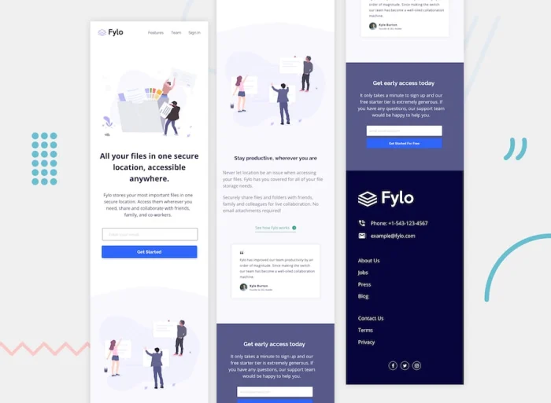

> README en espanol: [README-ES.md](./README-ES.md)
# Landing Page with React, Svelte and Vue
This is an example project of a landing page made in three different frameworks: React, Svelte and Vue. The goal is to show how to achieve the same result with different tools.

The landing page is fully responsive, it can be seen perfectly on every type and size of screen, from a PC monitor to a cell phone. It also has a modern and attractive design, with smooth animations and transitions.

## Demonstration
You can see the landing page in action in this link: 
[Live site URL](https://rtlsalazar.github.io/responsive-preview-component/site/index.html)

You can also see some screenshots of how the landing page looks:

| Desktop | Mobile | 
| - | - |
|  | |

## Installation and use

To clone, install and run this project locally, you need to have [Git], [Node.js] and [npm] installed on your computer.

Then, follow these steps:
1. Open a terminal and clone this repository with the command `git clone https://github.com/rtlsalazar/responsive-landing-page-Fylo.git`.
2. Enter the project directory with the command `cd responsive-landing-page-Fylo`.
3. Choose the framework you want to use (React, Svelte or Vue) and enter the corresponding subdirectory with the command `cd src-react`, `cd src-svelte` or `cd src-vue`.
4. Install the necessary dependencies with the command `npm install`.
5. Run the project in development mode with the command `npm run dev`.
6. Open your browser and visit the address `http://localhost:80` to see the landing page.